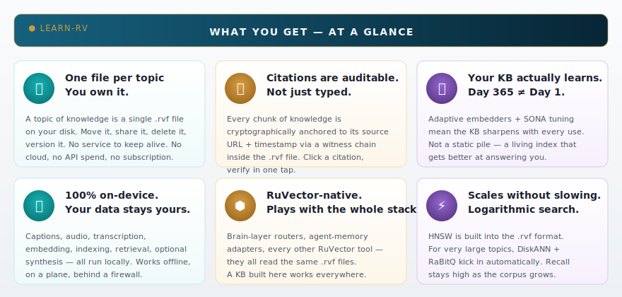
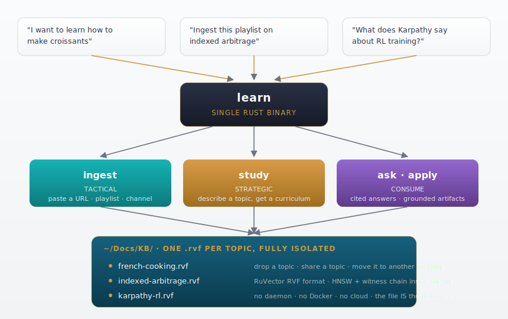
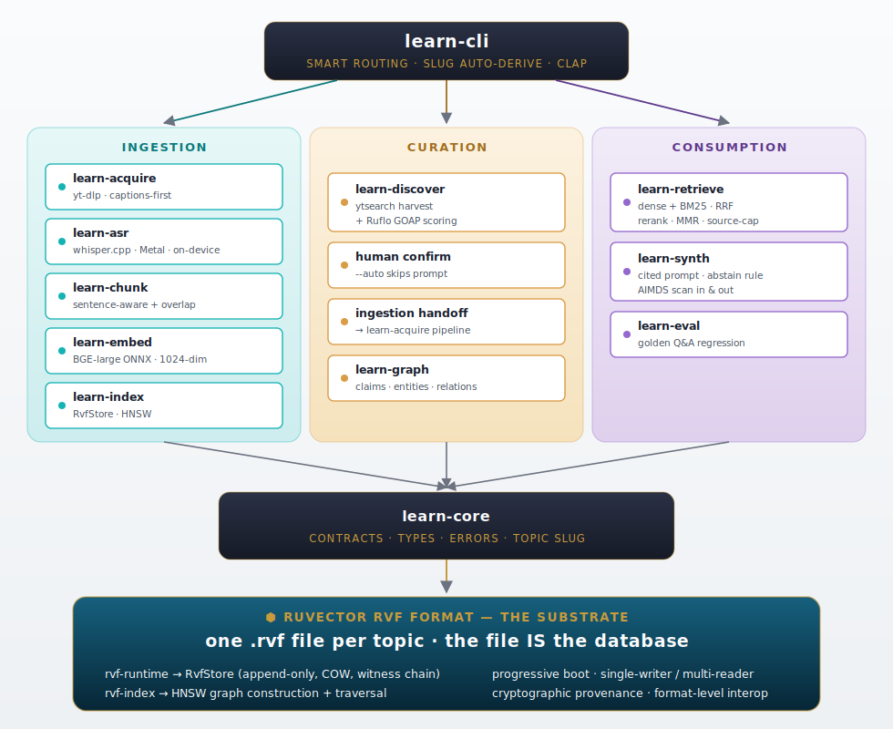
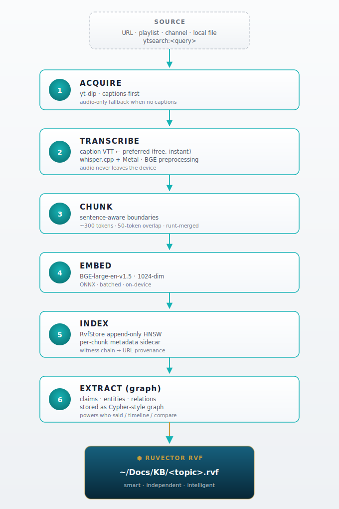
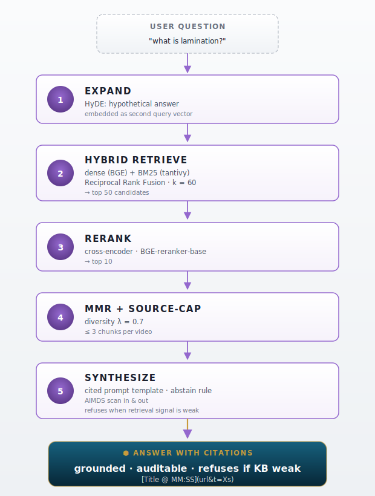
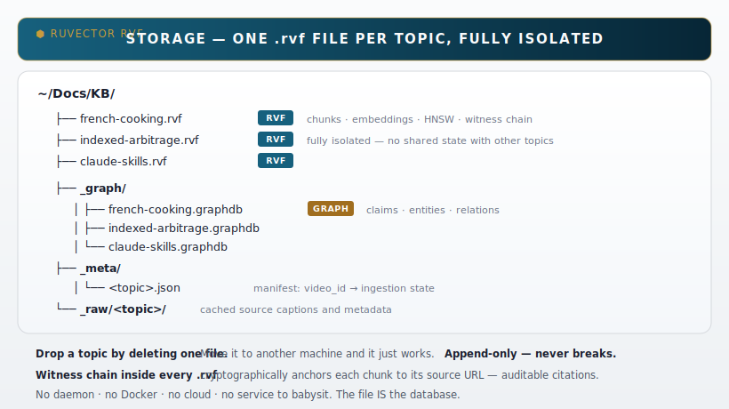
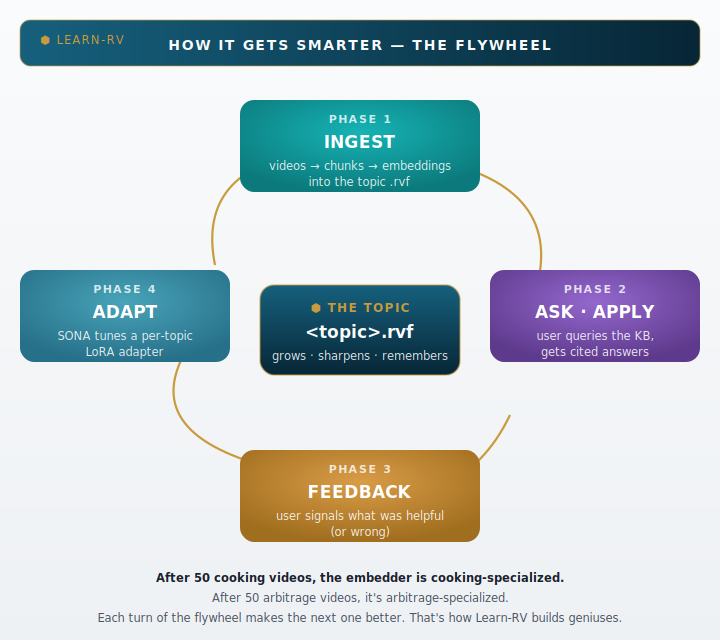
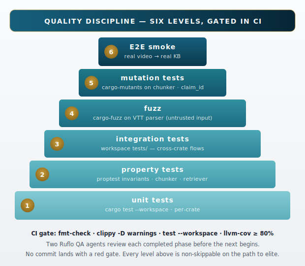

# Learn-RV

Your tool for building intelligent knowledge bases, stored in RuVector.

Point Learn-RV at a YouTube video — or a channel, playlist, or even a search like "french cooking technique" — and it builds a queryable knowledge base on disk. Every `learn ask` returns answers grounded in specific timestamps in specific videos, not hallucinated. Each topic is a single `.rvf` file. The KB sharpens with use through per-topic adaptive embeddings.

> **End-to-end verified 2026-05-02:** real ingest of `QZMljuD10sU` into `~/Docs/KB/claude-skills.rvf` (125 KB, 31 chunks) → cited Anthropic answer with `[1][2][3]` timestamp links.

## 30-second quickstart

```bash
learn ingest "https://youtu.be/QZMljuD10sU" --topic claude-skills
learn ask claude-skills "What does the speaker recommend for skill design?"
learn list claude-skills
```

Install (M-series Mac, from source):

```bash
cargo install --path crates/learn-cli
```



---

<details><summary>📦 What you can do with it (the 14 commands)</summary>

### Three ways in

Pick the one that matches what you already know.

**Tactical — `learn ingest`.** You already have the source. Paste a URL, playlist, channel, or local folder.

```
learn ingest "https://youtube.com/playlist?list=PLxxx"
learn ingest "https://youtu.be/abc" --topic indexed-arbitrage
learn ingest "/Users/me/lectures/" --topic university-physics
```

**Strategic — `learn study`.** You know what you want to learn, but not the right sources. Describe the topic. Learn-RV discovers a curriculum, ranks candidates by authority and recency, shows the shortlist, and ingests on confirmation.

```
learn study "How to make laminated pastry"
learn study "ETF arbitrage strategies" --depth deep
learn study "RAG architectures 2026" --auto
```

**Consume — `learn ask` and `learn apply`.** `ask` returns a cited answer. `apply` uses the KB as the prior to produce a grounded artifact — a recipe, a strategy, a plan, code.

```
learn ask  french-cooking      "what is lamination and why does it matter?"
learn apply french-cooking     "give me a croissant recipe with weights in grams"
learn apply indexed-arbitrage  "design a long-short ETF strategy with risk caps"
```

**Inspect — `learn status`.**

```
learn status french-cooking
```

Prints the topic's vector count, segment count, file size, plus an integrated-information KPI scoring how coherent the corpus is — `Disjoint`, `Loose`, `Coherent`, or `HighlyIntegrated` — so you can see at a glance whether the videos in this topic actually form a coherent body of knowledge.

### The remaining subcommands

`learn list`, `learn who-said`, `learn timeline`, `learn compare`, `learn summarize`, `learn watch`, `learn eval`, `learn forget`, `learn compact`. Run `learn <command> --help` for usage on each.

</details>

<details><summary>🏗️ How it works (architecture)</summary>

### Top-level invocation



<details><summary>ASCII fallback (for AI/accessibility)</summary>

```text
                  ┌──────────────────────────────────────────────┐
                  │   "I want to learn how to make croissants"    │
                  │   "Ingest this playlist on indexed arbitrage" │
                  │   "What does Karpathy say about RL training?" │
                  └──────────────────────────────────────────────┘
                                       │
                                       ▼
                       ╔═══════════════════════════╗
                       ║          learn            ║
                       ║   single Rust binary      ║
                       ╚═══════════════════════════╝
                                       │
                       ┌───────────────┼───────────────┐
                       ▼               ▼               ▼
                ┌─────────────┐ ┌─────────────┐ ┌─────────────┐
                │   ingest    │ │    study    │ │  ask/apply  │
                │  tactical   │ │ autonomous  │ │  consume    │
                └─────────────┘ └─────────────┘ └─────────────┘
                       │               │               │
                       └───────────────┴───────────────┘
                                       │
                                       ▼
                          ┌───────────────────────┐
                          │  ~/Docs/KB/           │
                          │  ├─ french-cooking.rvf │
                          │  ├─ indexed-arbitrage.rvf│
                          │  └─ <your-topic>.rvf  │
                          └───────────────────────┘
```

</details>

### Crate layout



<details><summary>ASCII fallback (for AI/accessibility)</summary>

```text
                ┌────────────────────────────────────────────────┐
                │                  learn-cli                      │
                │   (clap, smart routing, slug auto-derive)       │
                └────────────────────────────────────────────────┘
                                       │
            ┌──────────────────────────┼──────────────────────────┐
            ▼                          ▼                          ▼
   ┌─────────────────┐       ┌──────────────────┐       ┌──────────────────┐
   │  INGESTION      │       │  CURATION        │       │  CONSUMPTION     │
   │                 │       │                  │       │                  │
   │ learn-acquire   │       │ learn-discover   │       │ learn-retrieve   │
   │   yt-dlp + VTT  │       │   ytsearch +     │       │   hybrid +       │
   │ learn-asr       │       │   GOAP scoring   │       │   rerank + MMR   │
   │   whisper.cpp   │       │                  │       │                  │
   │ learn-chunk     │       │  human confirm   │       │ learn-synth      │
   │   semantic      │       │     ↓            │       │   cited answer   │
   │ learn-embed     │       │   ingestion      │       │   abstain rule   │
   │   BGE-large ONNX│       │                  │       │   AIMDS scan     │
   │ learn-index     │       │                  │       │                  │
   │   RvfStore      │       │                  │       │                  │
   │ learn-graph     │       │                  │       │                  │
   │   claims/entities│      │                  │       │                  │
   └─────────────────┘       └──────────────────┘       └──────────────────┘
            │                          │                          │
            └──────────────────────────┼──────────────────────────┘
                                       ▼
                          ┌────────────────────────┐
                          │      learn-core         │
                          │   (contracts, errors,   │
                          │   Topic slug, types)    │
                          └────────────────────────┘
                                       │
                                       ▼
                  ┌────────────────────────────────────────┐
                  │         RUVECTOR RVF FORMAT             │
                  │                                          │
                  │  rvf-runtime  →  RvfStore (HNSW + COW)   │
                  │  rvf-index    →  HNSW graph              │
                  │  rvf-types    →  on-wire format          │
                  │                                          │
                  │  append-only · progressive boot ·         │
                  │  single-writer/multi-reader · witness    │
                  │  chain for cryptographic provenance       │
                  └────────────────────────────────────────┘
```

</details>

Twelve Rust crates, single workspace, single binary. Every architectural choice is locked in code, not in prose: contracts live in `learn-core` and the rest of the system consumes them.

### Ingest pipeline



<details><summary>ASCII fallback (for AI/accessibility)</summary>

```text
                        ┌──────────────────────┐
                        │   source: URL / path  │
                        │   playlist / channel  │
                        │   ytsearch:<query>    │
                        └──────────────────────┘
                                  │
                                  ▼
                        ┌──────────────────────┐
                        │  ACQUIRE              │
                        │  yt-dlp               │
                        │  captions-first       │
                        │  audio-only fallback  │
                        └──────────────────────┘
                                  │
                                  ▼
                  ┌───────────────────────────────┐
                  │  TRANSCRIBE                    │
                  │  caption VTT (free, instant) ◀─┼─ preferred
                  │  whisper.cpp / Metal           │
                  │   (audio never leaves device)  │
                  └───────────────────────────────┘
                                  │
                                  ▼
                  ┌───────────────────────────────┐
                  │  CHUNK                         │
                  │  sentence-aware boundaries     │
                  │  ~300 tokens, 50-token overlap │
                  │  runt-tail merged, no orphans  │
                  └───────────────────────────────┘
                                  │
                                  ▼
                  ┌───────────────────────────────┐
                  │  EMBED                         │
                  │  BGE-large-en-v1.5 (1024-dim)  │
                  │  ONNX, batched, on-device      │
                  └───────────────────────────────┘
                                  │
                                  ▼
                  ┌───────────────────────────────┐
                  │  INDEX                         │
                  │  RvfStore append-only HNSW     │
                  │  per-chunk metadata sidecar    │
                  │  witness chain → URL provenance│
                  └───────────────────────────────┘
                                  │
                                  ▼
                  ┌───────────────────────────────┐
                  │  EXTRACT (graph layer)         │
                  │  claims · entities · relations │
                  │  stored as Cypher-style graph  │
                  │  for who-said / timeline /     │
                  │  compare queries               │
                  └───────────────────────────────┘
                                  │
                                  ▼
                       ┌────────────────────┐
                       │  ~/Docs/KB/         │
                       │  <topic>.rvf        │
                       └────────────────────┘
```

</details>

### Query path



<details><summary>ASCII fallback (for AI/accessibility)</summary>

```text
              QUERY PATH

                    ┌─────────────────┐
                    │   user question  │
                    └─────────────────┘
                            │
                            ▼
                ┌──────────────────────────┐
                │  EXPAND                   │
                │  HyDE: hypothetical answer│
                │  embedded as second query │
                └──────────────────────────┘
                            │
                            ▼
                ┌──────────────────────────┐
                │  HYBRID RETRIEVE          │
                │  dense (BGE) + BM25       │
                │  Reciprocal Rank Fusion   │
                │  → top 50                 │
                └──────────────────────────┘
                            │
                            ▼
                ┌──────────────────────────┐
                │  RERANK                   │
                │  cross-encoder (BGE-base) │
                │  → top 10                 │
                └──────────────────────────┘
                            │
                            ▼
                ┌──────────────────────────┐
                │  MMR + SOURCE-CAP         │
                │  diversity λ=0.7          │
                │  ≤3 chunks per video      │
                └──────────────────────────┘
                            │
                            ▼
                ┌──────────────────────────┐
                │  SYNTHESIZE               │
                │  cited prompt template    │
                │  abstain if signal weak   │
                │  AIMDS scan in/out        │
                └──────────────────────────┘
                            │
                            ▼
              ┌────────────────────────────────┐
              │   answer with citations         │
              │   [Title @ MM:SS](url&t=Xs)     │
              └────────────────────────────────┘
```

</details>

### Why each decision

| Decision | What it buys |
|---|---|
| **Captions-first acquisition** | Skips the multi-MB video download on the 90%+ of YouTube videos that already have transcripts. Bandwidth and time savings scale with corpus size. |
| **Local Whisper on-device** | Audio never leaves the machine. No per-minute API spend. No quota. Works offline. |
| **Sentence-aware chunking with overlap** | Retrieval coherence. A naive fixed-N-chars chunker splits mid-sentence, mid-thought. A query about a concept ends up matching half the explanation. |
| **BGE-large-en-v1.5 (1024-dim)** | Best-in-class English sentence embedder. Higher dimensionality than 384-dim baselines = better separation when corpus grows. |
| **HNSW via RvfStore** | Logarithmic search at any scale. The same file format Stuart's other RuVector projects use — interoperable. |
| **Hybrid retrieval (dense + BM25)** | Dense embeddings miss exact-keyword and jargon hits; BM25 misses paraphrase. Together via RRF, neither blind spot wins. |
| **Cross-encoder reranker** | A tiny model that compares query and candidate jointly, fixing the order errors a bi-encoder makes when concept and wording diverge. |
| **MMR + source-cap** | Prevents a single chatty video from monopolizing the top-10. Diverse evidence beats a single source with ten chunks. |
| **Citation-grounded synthesis** | Every claim points to `[Title @ MM:SS](url&t=Xs)`. The user can verify in one click. |
| **Abstain rule** | When the corpus doesn't cover the question, the system says so instead of inventing. Hallucination prevention as a primitive. |
| **Witness chain** | Citations aren't just text — they're cryptographically anchored on insert. A KB you can audit. |
| **Per-topic .rvf files** | Drop a topic, share a topic, version a topic. The unit of intelligence matches the unit of file. |

</details>

<details><summary>📂 Where files live (storage model)</summary>



<details><summary>ASCII fallback (for AI/accessibility)</summary>

```text
~/Docs/KB/
├── french-cooking.rvf       ← chunks · embeddings · HNSW · witness chain
├── indexed-arbitrage.rvf    ← fully isolated from french-cooking
├── claude-skills.rvf
├── _graph/
│   ├── french-cooking.graphdb       claims, entities, relations
│   ├── indexed-arbitrage.graphdb
│   └── claude-skills.graphdb
├── _meta/
│   └── <topic>.json                 manifest: video_id → state
└── _raw/<topic>/
    ├── <video_id>.info.json         yt-dlp metadata cache
    └── <video_id>.vtt               raw captions cache
```

</details>

Per-topic isolation is total: separate files, separate HNSW indices, no shared state. Drop a topic by deleting one file. Move the whole thing to another machine and it just works.

The `.rvf` file format gives us four things for free:

1. **Append-only writes** — re-ingestion never corrupts existing data.
2. **Progressive boot** — readers can start serving queries before the full file is loaded.
3. **Single-writer / multi-reader** with advisory locking — concurrent reads are safe.
4. **Witness chain** — every chunk inserted is cryptographically anchored to its source URL, so citations are auditable, not just typed.

### Why RVF, not "another folder of embeddings"

One topic of knowledge → one `.rvf` file. The file *is* the database. There is no schema migration, no service to start, no port to bind. The format itself buys seven things at once:

| Property | What it gives the KB |
|---|---|
| **Append-only with copy-on-write** | Re-ingesting a topic cannot corrupt existing data. New chunks become a new segment; old segments are untouched. A crashed write is still readable up to the last committed segment. |
| **Single-writer / multi-reader** | One ingest can run while many readers query. Advisory locking enforces it. |
| **Progressive boot** | A reader serves queries before the full file is mapped. KBs that grow to gigabytes don't pay the cost on every cold start. |
| **HNSW native to the format** | The vector index is *inside* the file, not bolted on as a sidecar. Search is logarithmic without external coordination. Compaction reclaims dead space without taking the KB offline. |
| **Witness chain** | Every chunk insert is cryptographically anchored to its source URL and timestamp. Citations the system returns are auditable — not just text the model typed. |
| **No external moving parts** | No Postgres, no Pinecone, no Chroma, no SQLite-with-pgvector-shim, no daemon, no telemetry. Delete the file, the KB is gone. Move the file, the KB moves with it. |
| **Format-level interoperability** | Other RuVector tools — the brain-layer routers, the SONA learners, the agent memory adapters — read the same `.rvf` files. A KB built by Learn-RV is consumable everywhere else in the stack. |

</details>

<details><summary>🧠 The intelligence stack (BGE / HNSW / SONA / AIMDS)</summary>

### The flywheel — how it gets smarter



<details><summary>ASCII fallback (for AI/accessibility)</summary>

```text
INGEST → ASK → FEEDBACK → ADAPT → (back to INGEST, but smarter)
```

</details>

Every time you query the KB and signal which answers were helpful, SONA tunes a per-topic LoRA adapter that specializes the embedder for *your* domain. After 50 cooking videos, the embedder is cooking-specialized. After 50 arbitrage videos, it's arbitrage-specialized. Each turn of the flywheel makes the next one better.

### The four layers

- **BGE-large-en-v1.5 (1024-dim, ONNX, on-device)** — the dense embedder. Best-in-class English sentence model. Higher dimensionality than 384-dim baselines means better separation as the corpus grows.
- **HNSW via RvfStore** — the index. Logarithmic search regardless of corpus size. Native to the file format, not a bolt-on.
- **SONA per-topic adapters** — the learning layer. Tunes a LoRA on top of BGE for each topic, using your feedback signal. Day 365 ≠ Day 1.
- **AIMDS (`@ruflo/aidefence`)** — the safety layer. Scans inbound prompts and outbound synthesized answers for prompt-injection, PII leak, and adversarial content. Wired as middleware around `learn synth`.

### What "smart, independent, intelligent" means concretely

**Smart** — the vector index, the metadata, the provenance chain, and the embedding integration live in *one artifact*. They cannot drift out of sync because there is nothing to drift; they were written together, they get read together.

**Independent** — nothing else has to be running for a knowledge base to be queryable. No service. No license server. No connectivity. The `.rvf` file is sufficient.

**Intelligent** — HNSW gives sub-linear search; the witness chain gives auditability; append-only segments mean the KB only grows and never breaks; progressive boot means it stays responsive at any size. These are not features layered on top — they are properties of the file format itself.

</details>

<details><summary>🛠️ Building from source</summary>

```bash
# Clone Learn-RV
git clone https://github.com/stuinfla/learner-rv.git
cd learner-rv

# Clone RuVector alongside (Learn-RV depends on local crates from it)
git clone https://github.com/ruvnet/RuVector.git ../RuVector

# Build (M-series Mac)
rustup target add aarch64-apple-darwin
cargo build --release

# Install the binary
cargo install --path crates/learn-cli
```

### Runtime dependencies

- `yt-dlp` — `brew install yt-dlp`
- `ffmpeg` — `brew install ffmpeg`
- Whisper and BGE-large models auto-fetch into `~/.cache/learn-rs/models/` on first use.

### First run

```bash
./target/release/learn ingest "https://youtu.be/QZMljuD10sU"
# → topic: qzmljud10su
# → ~/Docs/KB/qzmljud10su.rvf created

./target/release/learn study "ETF arbitrage strategies"
# → topic: etf-arbitrage-strategies
# → curates 10 videos, asks confirm, ingests

./target/release/learn ask  qzmljud10su "what does this teach?"
./target/release/learn apply etf-arbitrage-strategies "design a market-neutral pairs strategy"
```

</details>

<details><summary>🧪 Testing + quality gates</summary>



<details><summary>ASCII fallback (for AI/accessibility)</summary>

```text
                     ┌─────────────────────────┐
                     │  Level 6: E2E smoke      │
                     │   (real video, real KB)  │
                     ├─────────────────────────┤
                     │  Level 5: mutation tests │
                     │   cargo-mutants on chunk │
                     │   and claim_id derivation│
                     ├─────────────────────────┤
                     │  Level 4: fuzz           │
                     │   cargo-fuzz on VTT      │
                     ├─────────────────────────┤
                     │  Level 3: integration    │
                     │   workspace tests/       │
                     ├─────────────────────────┤
                     │  Level 2: property tests │
                     │   proptest invariants    │
                     ├─────────────────────────┤
                     │  Level 1: unit tests     │
                     │   cargo test --workspace │
                     └─────────────────────────┘
```

</details>

CI gate (`cargo fmt --check`, `cargo clippy -- -D warnings`, `cargo test --workspace`, `cargo llvm-cov --summary-only`) must be green before any commit lands.

Two independent Ruflo QA agents review each completed phase: one for code quality, one for test gaps. Their findings are tracked and closed before the next phase begins.

### Install test tooling

```bash
cargo install cargo-llvm-cov cargo-mutants cargo-nextest
```

### Generate binary fixtures

Binary test fixtures (audio files) are not committed. Generate them with:

```bash
bash tests/generate_fixtures.sh
```

Requires `ffmpeg` on PATH (`brew install ffmpeg`).

### Run the full local gate

```bash
cargo fmt --check
cargo clippy --workspace --all-targets -- -D warnings
cargo test --workspace
cargo build --release --workspace
cargo llvm-cov --workspace \
  --exclude learn-asr --exclude learn-embed \
  --exclude learn-index --exclude learn-graph \
  --exclude learn-cli \
  --summary-only
```

### Fuzz the VTT parser

Requires Rust nightly and `cargo-fuzz`:

```bash
rustup toolchain install nightly
cargo install cargo-fuzz

cd crates/learn-acquire
mkdir -p fuzz/corpus/parse_vtt
cp ../../fixtures/short.vtt fuzz/corpus/parse_vtt/short.vtt
cargo +nightly fuzz run parse_vtt -- fuzz/corpus/parse_vtt/
```

See `crates/learn-acquire/fuzz/README.md` for full details.

### Mutation tests

```bash
cargo mutants -p learn-chunk -p learn-core
```

### E2E smoke test

After Phase 1 model files are in place:

```bash
cargo test --workspace -- --include-ignored e2e_ingest_and_retrieve_short_fixture
```

Full test pyramid, acceptance criteria, and tooling details: `docs/testing.md`.

</details>

<details><summary>🗺️ Roadmap + status</summary>

| Phase | What it delivers | State |
|---|---|---|
| 0 — Scaffold | 12-crate workspace, contracts, Ruflo init | ✅ |
| 1 — Ingest crates | acquire, asr, chunk, embed, index, graph | ✅ |
| 1.5 — RuVector capability adoptions | SONA, Coherence, Graph, DiskANN, ruvllm | ✅ |
| 2A — Two more capabilities | ReasoningBank, hybrid retrieval | ✅ |
| 2B — QA fix-pack | 13 items closed | ✅ |
| 2C — CLI wiring | `learn ingest` / `learn ask` / `learn apply` real | ✅ |
| 2D — First cited answer | end-to-end smoke against QZMljuD10sU | ✅ |
| 2E — Anthropic real | reqwest call, retry on 429/503, AIMDS-wrapped | ✅ |
| 2.5 — `learn study` | autonomous curriculum discovery | ✅ written, ⏳ confirmed |
| 3A — 10 remaining CLI subcommands | who-said, timeline, compare, summarize, list, status, watch, eval, forget, compact | ✅ written, ⏳ confirmed |
| 3B — Embeddings persisted + MMR cosine | proper cosine over real embeddings | ✅ written |
| 3C — AIMDS wiring | inbound + outbound scan envelopes | ✅ written, gated on binary publish |
| 3D — Eval harness | golden Q&A regression | ✅ written |
| 3E — Manifest crash-resume | per-video state transitions, resume on reopen | 🟡 in flight |
| 4A — Consciousness KPI | integrated-information score in `learn status` | ✅ written (placeholder pending upstream embedding-native API) |
| 4B — Formal proofs | invariants over chunker + claim_id | 🟡 in flight |
| 4C — Final QA panel | four-mandate pass over the elite state | ⏳ |
| 4D — ADR-index + DDD-validate | governance registration | ⏳ |
| 5 — Cross-platform | Intel Mac, Linux, Windows binaries | ⏳ |

</details>

<details><summary>⚠️ Honest caveats (what doesn't work yet)</summary>

Current state, 2026-05-02:

- **AIMDS package not on public npm.** The query path scans inbound and outbound text via `npx @ruflo/aidefence`. The package itself returns 404 on npm right now — the wiring is correct, but until the package ships you'll see a `WARN` line and the scan returns `Skipped`. Set `LEARN_AIMDS_BIN=/path/to/your/aidefence/binary` to point at a private build, or `LEARN_AIMDS_REQUIRED=1` to fail closed when the binary is absent.
- **Whisper fallback is wired but not exercised.** When yt-dlp can't pull captions, the design says fall through to local Whisper; today's `learn ingest` errors out on missing captions. Phase 2D-plus.
- **`@handle` and `ytsearch:` sources accepted by validator but not yet ingested.** Channel-handle and search-pseudo-scheme sources pass the safety validator (no shell injection), but the URL parser later rejects them. Single-URL and playlist URLs work today.
- **ruvector-consciousness KPI is a v1 placeholder.** The upstream crate exists with full IIT Φ implementation but expects an n×n transition matrix, not embedding vectors. The current KPI uses spectral primitives over the embedding similarity graph; will swap when an embedding-native upstream interface ships.
- **DiskANN scale path uses a private file format.** `LearnIndexLarge::compact` reads `vectors.bin` directly. Stable today; track for Phase 3 hardening if the upstream `ruvector-diskann` save format changes.

</details>

<details><summary>🔌 Configuration (env vars, AIMDS, SONA, sovereignty)</summary>

| Variable | Purpose | Default |
|---|---|---|
| `ANTHROPIC_API_KEY` | Required for `learn ask` / `learn apply` synthesis. | unset |
| `LEARN_SYNTH_LOCAL` | Set to `1` to use local RuVLLM instead of Anthropic. Keeps everything on-device. | `0` |
| `LEARN_AIMDS_REQUIRED` | Fail closed if the AIMDS binary is absent (instead of warning + skip). | `0` |
| `LEARN_AIMDS_BIN` | Path to a private AIMDS binary if you have one (the public npm package isn't published yet). | unset |
| `LEARN_KB_ROOT` | Where `.rvf` files live. | `~/Docs/KB` |
| `LEARN_MODEL_CACHE` | Where Whisper + BGE models cache. | `~/.cache/learn-rs/models` |
| `LEARN_LOG` | Tracing filter (`info`, `debug`, `learn_synth=trace`). | `info` |

### Sovereignty defaults

Out of the box, every byte of audio, every transcript, every embedding, and every HNSW index stays on the machine. The only outbound call is `learn ask` / `learn apply` to Anthropic for final synthesis — and even that you can swap for local RuVLLM by setting `LEARN_SYNTH_LOCAL=1`.

</details>

<details><summary>📜 License + contributing</summary>

Dual-licensed under either [MIT](LICENSE-MIT) or [Apache-2.0](LICENSE-APACHE) at your option.

Contributions welcome. Open an issue describing the change before sending a PR larger than ~50 lines, so we can align on the approach. The CI gate must be green; see the testing section above for the local equivalent.

</details>
