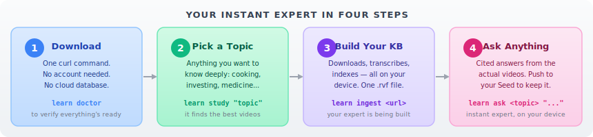
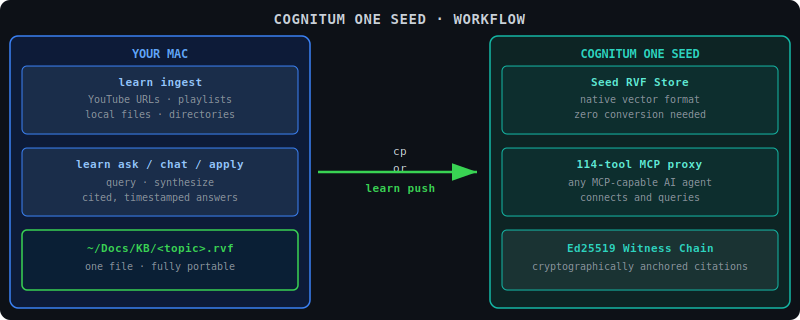
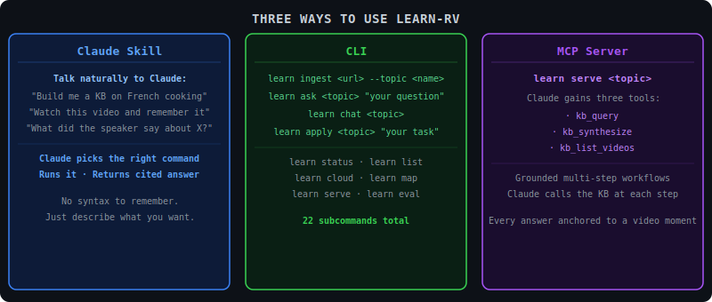

# Learn-RV

**Turn any video, playlist, or topic into an Instant Expert — stored entirely on your device.**

Pick a subject you care about. Learn-RV finds the best videos, downloads them, reads every word, and builds a searchable knowledge base that lives in one file on your machine. Then ask it anything. It answers in plain language with citations back to the exact video moment.

No cloud account. No subscription. No background service. Just your knowledge, on your device.


<details>
<summary>Overview diagram (text version for accessibility)</summary>

```
Talk to Claude            Use the CLI              Use MCP Server
"Build me a KB on         learn ingest <url>        learn serve <topic>
 French cooking"          learn ask <topic> "q"     → Claude gains
"Watch this video"        learn chat <topic>          kb_query
"What did it say?"        learn apply <topic> "t"     kb_synthesize
        ↓                         ↓                         ↓
                      learn binary
                            ↓
                    <topic>.rvf
               (one file, on your device)
```

</details>

---

## Your Instant Expert in Four Steps



<details>
<summary>Steps (text version)</summary>

```
1. Download  →  2. Pick a topic  →  3. Build your KB  →  4. Ask anything
   learn doctor     learn study "X"    learn ingest <url>   learn ask <topic> "?"
```

</details>

```bash
# 1. Install (M-series Mac — one command, no account needed)
curl -L https://github.com/stuinfla/learner-rv/releases/latest/download/learn-aarch64-apple-darwin.tar.gz \
  | tar xz -C /tmp && /tmp/learn-aarch64-apple-darwin/install.sh

# 2. Check everything is ready
learn doctor

# 3. Pick a topic and let Learn-RV find the best videos
learn study "sous vide cooking techniques"
# → Shows a shortlist of recommended videos, confirm to ingest

# 4. Ask your new expert anything
learn ask sous-vide "What temperature for a medium-rare steak?"
# → "54°C for 1–4 hours gives perfect medium-rare edge-to-edge [Sous Vide Everything @ 3:12]"

# 5. Chat with your expert (multi-turn, remembers the conversation)
learn chat sous-vide
```

> Your knowledge base lives at `~/Docs/KB/sous-vide.rvf` — one file you own completely.

---

## What You Get


<details>
<summary>Capabilities (text version)</summary>

```
Own your data   │  Cited answers  │  Self-learning
No cloud. One   │  Every answer   │  The KB gets
.rvf file you   │  points to the  │  smarter the
control fully.  │  exact moment.  │  more you use it.

On-device       │  RuVector-      │  Scales with
Everything runs │  native         │  you
on your machine.│  .rvf works     │  From one video
Audio never     │  with the whole │  to thousands,
leaves.         │  RuVector stack.│  same commands.
```

</details>

| You get | Because of how it works |
|---|---|
| Add videos anytime without corrupting the KB | Append-only RVF segments |
| Millisecond search across thousands of video chunks | HNSW index native to the file |
| Every answer traces to the exact video moment | Witness chain per chunk, cryptographically anchored |
| Move the whole KB to another machine — nothing to migrate | Single `.rvf` file = single unit |
| Works on Cognitum One Seed without conversion | RVF is the Seed's native vector format |

---

## For Cognitum One Seed Owners

**Learn-RV is built for the Seed.** Build a knowledge base on your Mac in minutes, push it to your Seed, and query it from any AI agent — anywhere, offline, no cloud required.



<details>
<summary>Seed workflow (text version for accessibility)</summary>

```
YOUR MAC                         TRANSFER              COGNITUM ONE SEED
─────────────────────────────    ────────────────────  ─────────────────────────────
learn ingest <video URLs>                              Seed RVF Store
learn study "your topic"         learn push <topic>    native vector format
learn ask / chat / apply    ──────────────────────→   zero conversion needed

~/Docs/KB/<topic>.rvf            (or: cp <topic>.rvf  114-tool MCP proxy
one file · fully portable         to Seed's RVF dir)  any MCP-capable agent
                                                       Ed25519 witness chain
                                                       cryptographic provenance
```

</details>

**Step-by-step for Seed owners:**

```bash
# On your Mac: pick a topic and build the expert
learn study "Japanese knife sharpening"        # finds the best videos
# or go direct:
learn ingest "https://youtube.com/playlist?list=PLxxx" --topic knife-sharpening

# Verify it's working
learn ask knife-sharpening "What angle for a 210mm gyuto?"

# Push it to your Seed
learn push knife-sharpening                    # auto-discovers Seed on local network

# Now any AI agent connected to the Seed can query it
# The full knowledge base — including provenance — is on the Seed
```

**Why it fits the Seed:**
- RVF is the Seed's native vector store — no conversion, no export, no migration
- `learn serve <topic>` aligns with the Seed's 114-tool MCP proxy  
- Every ingest writes an Ed25519 witness chain, matching the Seed's custody model
- The Rust binary is compatible with the `cognitum-one` SDK

---

## Three Ways to Use It

Whether you prefer talking to Claude, typing commands, or wiring it into an AI workflow — it all leads to the same place: your knowledge, cited, on your device.



<details>
<summary>Three modes (text version for accessibility)</summary>

```
Claude Skill              CLI                        MCP Server
──────────────────        ─────────────────────────  ──────────────────────────────
Talk naturally:           learn ingest <url>          learn serve <topic>
"Build me a KB on         learn ask <topic> "q"
 French cooking"          learn chat <topic>          Claude gains:
"Watch this video"        learn apply <topic> "t"       · kb_query
"What did it say?"                                     · kb_synthesize
                          learn status / list           · kb_list_videos
Claude picks the          learn cloud / map
right command and         22 subcommands total        Grounded multi-step
runs it for you.                                      workflows — every answer
No syntax needed.                                     anchored to a video moment.
```

</details>

### 🤖 As a Claude Code skill (just talk to Claude)

Learn-RV installs as a global Claude Code skill. In any Claude session, just describe what you want:

> "Build me a knowledge base on Japanese knife sharpening."  
> "Watch this video and remember it: https://youtu.be/QZMljuD10sU"  
> "What did the speaker say about sharpening angle?"  
> "Apply what we learned in knife-sharpening to draft a sharpening routine for my 3 knives."

Claude reads the skill, picks the right `learn` subcommand, runs it, and returns a cited answer. No syntax to remember.

### 💻 As a CLI (direct control)

```bash
# Build a knowledge base
learn ingest "https://youtu.be/QZMljuD10sU" --topic claude-skills
learn ingest "https://youtube.com/playlist?list=PLxxx" --topic my-playlist
learn import ~/Downloads/lectures/ --topic university-physics   # local files

# Ask / apply / chat
learn ask   french-cooking "what is lamination and why does it matter?"
learn apply french-cooking "give me a croissant recipe with weights in grams"
learn chat  french-cooking                       # multi-turn dialog, session-persistent

# Inspect and visualize
learn status french-cooking                      # chunk count, coherence score
learn cloud  french-cooking                      # → SVG word cloud of key concepts
learn map                                        # → PCA galaxy of all your topics

# Push to your Cognitum Seed
learn push french-cooking
```

### 🔌 As an MCP server (Claude drives the KB end-to-end)

```json
// ~/.claude/mcp.json
{
  "mcpServers": {
    "learn-rv": {
      "command": "learn",
      "args": ["serve", "your-topic-name"]
    }
  }
}
```

Claude Code gains three tools: `kb_query`, `kb_synthesize`, `kb_list_videos`. Now you can say _"using my french-cooking topic, walk me through making croissants — write the schedule to disk, adjust if I tell you my kitchen is 68°F"_ and Claude calls the KB at each step, grounding every instruction in a specific video moment.

---

<details><summary>📦 All 22 commands</summary>

### Discovery + ingestion

**`learn study`** — Strategic: describe what you want to learn. Learn-RV discovers a curriculum, ranks candidates, shows a shortlist, ingests on confirmation.

```bash
learn study "How to make laminated pastry"
learn study "ETF arbitrage strategies" --depth deep
learn study "RAG architectures 2026" --auto
```

**`learn ingest`** — Tactical: paste a URL, playlist, channel, or search query.

```bash
learn ingest "https://youtube.com/playlist?list=PLxxx"
learn ingest "https://youtu.be/abc" --topic indexed-arbitrage
```

**`learn import`** — Bulk ingest a local directory of files (PDF, MP4, MP3, TXT, MD).

```bash
learn import ~/Downloads/lectures/ --topic university-physics
learn import ~/Documents/recipes/ --topic french-cooking
```

### Consumption

**`learn ask`** — Cited answer grounded in the KB.  
**`learn apply`** — Uses the KB as prior to produce a grounded artifact (recipe, plan, code).  
**`learn chat`** — Multi-turn dialog with session persistence.  
**`learn quiz`** — Generates quiz questions from the KB to test your knowledge.

```bash
learn ask   french-cooking "what is the Maillard reaction?"
learn apply french-cooking "give me a laminated dough schedule for 20 croissants"
learn chat  french-cooking                                    # → interactive REPL
learn chat  french-cooking --resume <session-id>             # → resume a prior session
learn quiz  french-cooking                                    # → 5 questions with answers
```

Sessions persist at `~/Docs/KB/_chat/<topic>/<id>.jsonl`.

### Inspection + visualization

```bash
learn status   french-cooking   # chunk count, file size, coherence KPI
learn list     french-cooking   # videos in the topic
learn who-said french-cooking "Julia Child"          # which videos mention a name
learn timeline french-cooking "beurrage"             # chronological mentions
learn compare  french-cooking sourdough              # cross-topic concept overlap
learn cloud    french-cooking                        # SVG word cloud of top concepts
learn map                                            # PCA galaxy of all your topics
learn summarize french-cooking                       # key takeaways across the topic
```

### Distribution + maintenance

```bash
learn push    french-cooking   # push KB to Cognitum One Seed on local network
learn serve   french-cooking   # start MCP server for Claude Code integration
learn watch   french-cooking   # monitor a channel for new videos, auto-ingest
learn eval    french-cooking   # run golden Q&A regression against the KB
learn forget  french-cooking <video_id>    # remove one video from the KB
learn compact french-cooking               # defragment the RVF file
learn doctor                               # check deps, models, env, release version
```

</details>

<details><summary>🏗️ How it works</summary>

### Ingest pipeline


<details>
<summary>Pipeline (text version for accessibility)</summary>

```
Source URL / path
      ↓
  ACQUIRE (yt-dlp) — captions-first; audio-only fallback
      ↓
  SMART FRAME DECISION
  pHash variance → skip talking heads, extract visual demos
  Sonnet vision captions frames when useful
      ↓
  TRANSCRIBE — VTT captions (instant) or Whisper.cpp on-device
      ↓
  CHUNK — sentence-aware, ~300 tokens, 50-token overlap
      ↓
  EMBED — BGE-large-en-v1.5 (1024-dim, ONNX, on-device)
      ↓
  INDEX — RvfStore append-only HNSW + Ed25519 witness chain per chunk
      ↓
  AUTO-SUMMARY — 3–5 key takeaways via Sonnet
      ↓
  ~/Docs/KB/<topic>.rvf
```

</details>

### Query path


<details>
<summary>Query path (text version for accessibility)</summary>

```
User question
      ↓
  EXPAND — HyDE hypothetical answer as second query vector
      ↓
  HYBRID RETRIEVE — dense (BGE) + BM25, RRF fusion → top 50
      ↓
  RERANK — cross-encoder (BGE-base) → top 10
      ↓
  MMR + SOURCE-CAP — diversity λ=0.7, ≤3 chunks per video
      ↓
  SYNTHESIZE — cited prompt, abstain if signal weak, AIMDS scan in/out
      ↓
  Answer with [Title @ MM:SS](url&t=Xs) citations
```

</details>

### Architecture: 17 crates, one binary


| Layer | Crate | Responsibility |
|---|---|---|
| CLI | `learn-cli` | 22 subcommands, routing, orientation |
| Ingestion | `learn-acquire`, `learn-asr`, `learn-frames`, `learn-chunk`, `learn-embed`, `learn-index`, `learn-graph` | Full pipeline from URL to `.rvf` |
| Retrieval | `learn-retrieve` | Hybrid BM25+dense, rerank, MMR |
| Synthesis | `learn-synth` | Cited answers, in-tree AIMDS scanner |
| Chat | `learn-chat` | Multi-turn REPL, JSONL sessions |
| MCP | `learn-serve` | JSON-RPC 2.0 server for Claude Code |
| Contracts | `learn-core` | Shared types, errors, topic slug |

### Storage model


<details>
<summary>Storage layout (text version)</summary>

```
~/Docs/KB/
├── french-cooking.rvf          ← chunks · embeddings · HNSW · witness chain
├── indexed-arbitrage.rvf
├── french-cooking.summary.md   ← auto-generated key takeaways
├── _graph/
│   └── french-cooking.graphdb  ← claims, entities, relations
├── _meta/
│   └── french-cooking.json     ← per-video state (slug → progress)
└── _chat/
    └── french-cooking/         ← session JSONL files
```

</details>

Per-topic isolation is total. Drop a topic by deleting one file. Move the whole thing to another machine and it just works.

### Self-learning


- **BGE-large-en-v1.5 (1024-dim)** — best-in-class English sentence embedder, on-device ONNX
- **HNSW via RvfStore** — logarithmic search, native to the file format
- **SONA per-topic adapters** — LoRA fine-tuning per topic; the embedder specializes with use
- **In-tree AIMDS** — 12 inbound + 8 outbound regex patterns; scans every query and every answer

</details>

<details><summary>📂 One-time setup</summary>

**Easy path (M-series Mac or Linux x86_64 — no Rust required):**

```bash
# M-series Mac
curl -L https://github.com/stuinfla/learner-rv/releases/latest/download/learn-aarch64-apple-darwin.tar.gz \
  | tar xz -C /tmp && /tmp/learn-aarch64-apple-darwin/install.sh

# Linux x86_64
curl -L https://github.com/stuinfla/learner-rv/releases/latest/download/learn-x86_64-unknown-linux-gnu.tar.gz \
  | tar xz -C /tmp && /tmp/learn-x86_64-unknown-linux-gnu/install.sh
```

`install.sh` symlinks the binary to `~/.cargo/bin/learn` and drops the Claude Code skill into `~/.claude/skills/learn-rv/`.

**Build from source (any platform, Rust toolchain required):**

```bash
git clone https://github.com/stuinfla/learner-rv.git
cd learner-rv
git clone https://github.com/ruvnet/RuVector.git ../RuVector
cargo install --path crates/learn-cli
mkdir -p ~/.claude/skills/learn-rv
cp .claude/skills/learn-rv/SKILL.md ~/.claude/skills/learn-rv/SKILL.md
```

**Runtime dependencies:**
```bash
brew install yt-dlp ffmpeg   # macOS
# apt install yt-dlp ffmpeg  # Debian/Ubuntu
```

Whisper and BGE-large models auto-fetch into `~/.cache/learn-rs/models/` on first use (`learn doctor` shows status).

**Environment setup:**

Copy `.env.example` to `.env` and fill in your Anthropic API key (required for `learn ask`, `learn apply`, and `learn chat`):

```bash
cp .env.example .env
# edit .env and add: ANTHROPIC_API_KEY=sk-ant-...
```

</details>

<details><summary>⚙️ Configuration</summary>

| Variable | Purpose | Default |
|---|---|---|
| `ANTHROPIC_API_KEY` | Required for `learn ask` / `learn apply` / `learn chat` synthesis | unset |
| `LEARN_SYNTH_LOCAL` | `1` → use local RuVLLM instead of Anthropic. Fully on-device | `0` |
| `LEARN_AIMDS_REQUIRED` | `1` → fail closed on any `Blocked` AIMDS verdict | `0` |
| `LEARN_KB_ROOT` | Where `.rvf` files live | `~/Docs/KB` |
| `LEARN_MODEL_CACHE` | Where Whisper + BGE models cache | `~/.cache/learn-rs/models` |
| `RUST_LOG` | Tracing filter (`info`, `debug`, `learn_synth=trace`) | `warn` |

**Sovereignty defaults:** Every byte of audio, every transcript, every embedding, and every index stays on the machine. The only outbound call is `learn ask`/`learn apply` to Anthropic — swap for local RuVLLM with `LEARN_SYNTH_LOCAL=1`.

</details>

<details><summary>🖥️ Platform support</summary>

| Platform | Binary? | Notes |
|---|---|---|
| M-series Mac (`aarch64-apple-darwin`) | ✅ v0.2.5 | Primary, fully supported |
| Linux x86_64 (`x86_64-unknown-linux-gnu`) | ✅ v0.2.5 | Captions-only (no local Whisper on Linux) |
| Windows (`x86_64-pc-windows-msvc`) | ✅ v0.2.6 | No on-device ASR (whisper-rs is Apple-only) |
| Intel Mac (`x86_64-apple-darwin`) | Build from source | macOS-13 runner deprecated by GitHub |
| Linux ARM64 | Build from source | cross-Docker can't reach RuVector path-deps |

</details>

<details><summary>⚠️ Honest caveats</summary>

Current state: v0.2.5 (2026-05-05)

- **Linux ARM64 + Intel Mac binaries are not published.** Build from source. Reasons: `cross` Docker cannot reach the `../ruvector` sibling path-dep; macOS-13 runner deprecated.
- **Coherence KPI** uses Fiedler eigenvalue × NN-cosine density — a useful relative health signal, not a research-grade IIT Φ.
- **AIMDS guardrails** are in-tree regex patterns (12 inbound, 8 outbound). Synchronous, zero-subprocess, intentionally lightweight.
- **SONA self-learning** works but the feedback signal that updates the LoRA adapter requires explicit `record_feedback` API calls — not yet wired into a passive thumbs-up/down on `learn ask`.
- **Smart frame decision** runs pHash variance; low-variance (talking-head) videos skip frame extraction automatically to save API budget.
- **Windows** builds and runs but omits on-device speech recognition (`learn-asr` is Apple-only due to whisper-rs metal feature).

</details>

<details><summary>🧪 Testing</summary>

```bash
cargo fmt --check
cargo clippy --workspace --all-targets -- -D warnings
cargo test --workspace
cargo build --release --workspace
```

CI requires all four green before merge. 311+ unit + integration tests.

</details>

<details><summary>📜 License + contributing</summary>

Dual-licensed under [MIT](LICENSE-MIT) or [Apache-2.0](LICENSE-APACHE) at your option.

Contributions welcome. Open an issue before sending a PR larger than ~50 lines so we can align on approach. CI gate must be green.

</details>

---

*Built with [RuVector](https://github.com/ruvnet/ruvector) · MIT/Apache-2.0 · [Releases](https://github.com/stuinfla/learner-rv/releases)*
